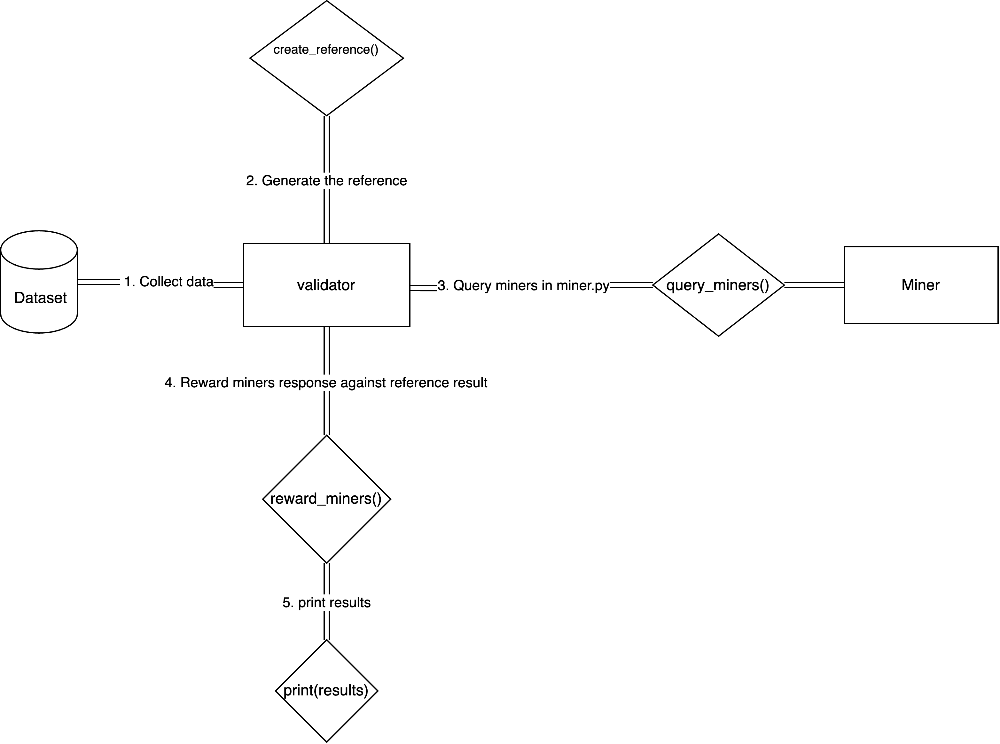

# **Coding Exercise: Decentralized Calculator Development**

## **Overview:**

In this coding exercise, you will design and implement a decentralized calculator that operates through a collaborative system using a dataset. This exercise is divided into three main parts - Data Acquisition, Protocol (Validator), and Miner. Each part tests different skills, such as data handling, incentive mechanism design, and problem-solving capabilities. This will be done across three Python files that you will modify during the exercise.

## **Context**



This repo is a toy representation exercise of a bittensor subnet. This goal is to building a decentralized calculator with validators and miners interacting with each other using an incentive mechanism. The flow follows main 4 steps:
1. Starting from `validator.py` main entrypoint, the `execute_validator_step()` initiates the data acquision process with `load_dataset()`.
The dataset contains 3 columns:
- n_1: first number of the operation
- n_2: second number of the operation
- operand: string represeting the operand.

2. With loaded data, you can generate the reference by creating the reference answer for the operation `n_1 operand n_2`. To better illustrate, let's consider the row values `5 (n_1), '+' (operand), 5 (n_2)`. The reference result should be 10 (5 + 5). 

3. Miners contribute to the problem solving by providing an answer. The best answers are directly aligned with the reference answer, so miners try their best to simulate the reference answer.

4. With the reference and the miner completion at hand, the validator rewards the miner completion by comparing it to the reference. A binary model reward evaluation for this problem could be simplified as:
```python
reward = 1 if miner_completion == reference else 0
```
> Note that you don't need to limit yourself into a binary output as you can scale the reward from the distance of the miner_completion to the reference, creating a continuous reward model.

5. The execution step finishes with the rewards being printed by miner properly.


# Useful links:
https://docs.bittensor.com/learn/bittensor-building-blocks


## **Objective:**

Build a decentralized system that utilizes a dataset to perform calculations distributed across different modules (Data acquisition, Validator, Miner).

## **Files Provided:**

1. `data.py`: Manages data retrieval from a public Hugging Face dataset.
2. `validator.py`: Orchestrates the incentive mechanisms and validation of calculations.
3. `miner.py`: Handles the computation of results based on the input data.

## **Step-by-Step Instructions:**

### **Step 1: Data Acquisition**
- **Objective**: Demonstrate how you handle data collection from a public dataset.
- **Task**: In `data.py`, implement functionality to fetch a dataset that includes three columns: `n_1`, `n_2`, `operation`. This dataset represents the numbers to be calculated and the operation to be applied.

### **Step 2: Protocol (Validator)**
- **Objective**: Test your ability to build an incentive mechanism for decentralized systems.
- **Task**: In `validator.py`, using the dataset from Step 1, do the following:
  - Generate the reference value by performing the specified `operation` on `n_1` and `n_2`.
  - Request results from the miners and compare them to the reference value.

### **Step 3: Miner**
- **Objective**: Assess your problem-solving skills in an isolated mining environment.
- **Task**: In `miner.py`, receive inputs (`n_1`, `n_2`, `operation`) and compute the result. Your implementation should match the expected operation (addition, subtraction, etc.).

## **Extra Points Opportunities:**
- Implement data acquisition in batches in `data.py`.
- Use an advanced incentive mechanism in `validator.py` that rewards miners not just for correct answers but for closeness to the reference value.
- Employ asynchronous programming in the reference generation and mining querying processes in `validator.py`.
- Handle batch operations in both reference generation and mining querying in `validator.py`.
- Present multiple solution approaches, especially in how operations are interpreted and executed in `miner.py`.

## **Evaluation Criteria:**
- Code Quality: Clarity, maintainability, and adherence to standard Python coding conventions.
- Problem Solving: Efficiency and accuracy of the solutions.
- Creativity and Innovation: Approaches in data handling, calculation, and incentive mechanisms.
- Completeness: All tasks should be fully and correctly implemented.


> Note: Consider validator.py as the entrypoint of your application. Feel free to modify the code in any way you want.

Prepare to discuss your code and thought processes, as part of the interview may include a review of how you approached the exercise.